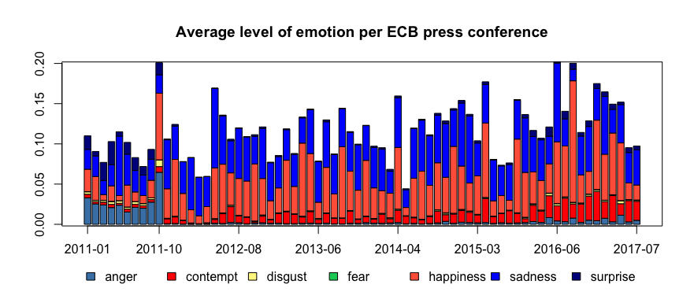

[](http://quantlet.de/)

## [](http://quantlet.de/) **FVCbarplot** [](http://quantlet.de/)

```yaml

Name of Quantlet: FVCbarplot

Published in: Face Value of Companies

Description: 'Plots scores for seven emotions (anger, contempt, disgust, fear, happiness, sadness, surprise) generated by Microsoft cognitive API for 70 press conferences held by the European Central Bank (Jan. 2011 - Sep 2017).'

Keywords: financial, plot, empirical, correlation, visualization, neural-network

Author: Sophie Burgard

Submitted:  05.11.2017

Datafile: 'ECB_avg_emo.csv'


```



### R Code
```r

#open dataset, set working directoy if requires
#setwd(....)
avg_emo = read.csv2('ECB_avg_emo.csv')

#select relevant columns. here: ignore 'neutral'
levels = avg_emo[, c(2:6,8,9)]

#transpose and redefine as matrix
levels = t(as.matrix(levels))

#set color scheme for each emotion
cols = c('steelblue',    #anger
         'red',          #contempt
         'khaki1',       #disgust
         'springgreen3', #fear
         'tomato1',      #happiness
         'blue',         #sadness
         'darkblue')     #surprise

#generate graphic
dev.off() # delete old graphical parameters

#general setting
m = barplot(levels, 
            main = 'Average level of emotion per ECB press conference',
            col  = cols, 
            xaxt = 'n') #deactivate automatic axes labeling

#legend specifications
legend('bottom', 
       fill  = cols, 
       c('anger', 'contempt', 'disgust', 'fear', 'happiness', 'sadness', 'surprise'), 
       horiz = TRUE, 
       xpd   = TRUE,  
       inset = c(0, -0.4), 
       bty   = 'n')

#add box around plot
box(which = 'plot', lty = 'solid')

#preparation for x-axis labeling
event.plot        = avg_emo$event
event.plot        = as.character(event.plot)
event.plot        = as.data.frame(paste0('20', event.plot))
names(event.plot) = 'event'
event.plot$event  = as.character(event.plot$event)
event.plot$event  = paste0(substr(event.plot$event, 1, 4), '-', substr(event.plot$event, 5, 6))
event.plot        = append(append(event.plot[1:61,], '2016-09'), event.plot[62:69,])

# add to x-axis tick and labeling
axis(side   = 1, 
     at     = m[c(1, 10, 20, 30, 40, 50, 60, 70)], 
     labels = event.plot[c(1, 10, 20, 30, 40, 50, 60, 70)])


```

automatically created on 2018-05-28