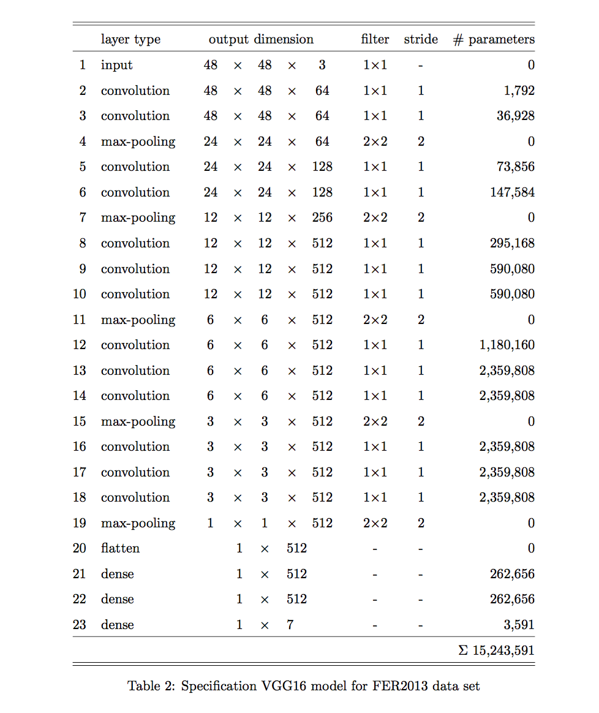
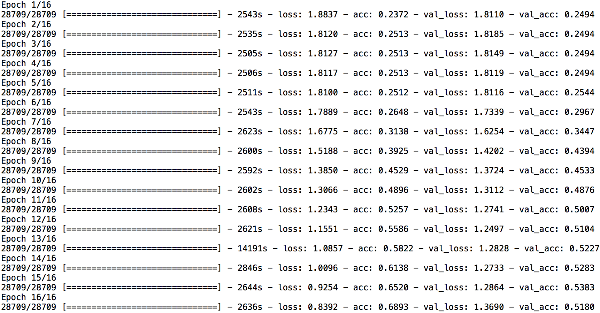

[](http://quantlet.de/)

## [](http://quantlet.de/) **FVCfinetuning** [](http://quantlet.de/)

```yaml

Name of Quantlet: FVCfinetuning

Published in: Face Value of Companies

Description: "Finetunes an Convolutional Neural Network that classifies facial expressions into seven basic emotions (anger, disgust, fear, happiness, neutral, sadness, surprise). The underlying deep convolutional net is trained on VGGface. Image based static facial expression recognition with multiple deep network learning. The original dataset can be obtained from kaggle's 'Facial Expression Recognition Challenge'. The subfolder 'model weights' contains model weights and model architecture in .json-Format. This allows to access the estimation results without rerunning the calculations. VGGFace implementation on keras by github.com/rcmalli/keras-vggface. "


Keywords: neural-network, estimation, empirical, optimization, descending-gradients

Author: Sophie Burgard

Submitted: '05.11.2017'


```





### PYTHON Code
```python

#set working directory
path = '...'

import os
os.chdir(path)
os.getcwd()


import h5py
import keras
import numpy as np
from keras.engine import  Model
from keras.layers import Flatten, Dense, Input
from keras.models import model_from_json

#Implementation of VGG by https://github.com/rcmalli/keras-vggface
from keras_vggface.vggface import VGGFace


#load data, requires function load_dataset() from Q-let: FVCload_dataset 
#and original data from Kaggle's Facial Expression Recognition Competition 2013
from FVCload_dataset import load_dataset
(x_train, y_train), (x_test, y_test), (x_valid, y_valid) = load_dataset() 


#reshape data
x_train1  = x_train.reshape(-1, 48, 48, 1)
x_test1   = x_test.reshape(-1, 48, 48, 1)
x_valid1  = x_valid.reshape(-1, 48, 48, 1)

#normalizing input data
x_train1 /= 255.0
x_test1  /= 255.0
x_valid1 /= 255.0

#one-hot-encoding
y_train = keras.utils.np_utils.to_categorical(y_train)
y_test  = keras.utils.np_utils.to_categorical(y_test)
y_valid = keras.utils.np_utils.to_categorical(y_valid)


#vggface is trained on 3 channel, colored data. orig data is greyscale (color dim = 1)
#extending to 3 channels
x_train = np.concatenate((x_train1, x_train1, x_train1), axis = 3)
x_test  = np.concatenate((x_test1, x_test1, x_test1), axis = 3)
x_valid = np.concatenate((x_valid1, x_valid1, x_valid1), axis = 3)

#reshapes dorm
input_reshape = (48, 48, 3)

#custom parameters for validation
nb_class   = 7
hidden_dim = 512

vgg_model  = VGGFace(include_top = False, input_shape = input_reshape)
last_layer = vgg_model.get_layer('pool5').output

x     = Flatten(name='flatten')(last_layer)
x     = Dense(hidden_dim, activation='relu', name='fc6')(x)
x     = Dense(hidden_dim, activation='relu', name='fc7')(x)
out   = Dense(nb_class, activation='softmax', name='fc8')(x)
model = Model(vgg_model.input, out)


model.compile(loss='categorical_crossentropy', optimizer='adam', metrics=['accuracy'])

trained_model_conv = model.fit(x_train, y_train, epochs= 16, batch_size=250, validation_data=(x_test, y_test))


# serialize model to JSON
model_json = model.to_json()
with open("model_finetune.json", "w") as json_file:
    json_file.write(model_json)
# serialize weights to HDF5
model.save_weights("weights_finetune.h5")
print("Saved model to disk")
 
# for using mode without rerunning:
 # load json and create model
json_file = open('model_finetune.json', 'r')
loaded_model_json = json_file.read()
json_file.close()
loaded_model = model_from_json(loaded_model_json)
# load weights into new model
loaded_model.load_weights("weights_finetune.h5")
print("Loaded model from disk")
 
# evaluate loaded model on test data
loaded_model.compile(loss='categorical_crossentropy', optimizer='adam', metrics=['accuracy'])
score = loaded_model.evaluate(x_test, y_test, verbose=0)
print("%s: %.2f%%" % (loaded_model.metrics_names[1], score[1]*100))


```

automatically created on 2018-05-28