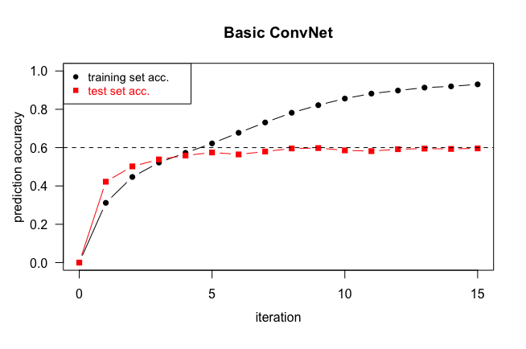

[](http://quantlet.de/)

## [](http://quantlet.de/) **FVCperformance** [](http://quantlet.de/)

```yaml

Name of Quantlet: FVCperformance

Published in: Face Value of Companies

Description: 'Plots accuracy of FVCConvNet and FVCConvNetFinetune 
on identical training and validation set for each iteration of estimation'

Keywords: neural-network, estimation, empirical, optimization, descending-gradients, plot

Author: Sophie Burgard

Submitted: 05.11.2017


```




### R Code
```r

#set up data
epochs       =  seq(0, 15, 1)

conv_acc     = c(0, 0.3118, 0.4468, 0.5221, 0.5727, 0.6219, 
                0.6774, 0.7312, 0.7819, 0.8216, 0.8560, 0.8819,
                0.8978, 0.9132, 0.9196, 0.9302)

conv_val_acc = c(0, 0.4221, 0.5021, 0.5383, 0.5587, 0.5748, 0.5645,
                 0.5795, 0.5957, 0.5977, 0.5857, 0.5818, 0.5918,
                 0.5949, 0.5932, 0.5960)


dev.off()
par(bg ='transparent')
plot(epochs, conv_acc, pch = 16, axes = FALSE, ylim = c(0, 1), xlab = '', ylab = '', 
     type = 'b',col = 'black', main = 'Basic ConvNet')
lines(epochs, conv_val_acc, pch = 15,  xlab = '', type = 'b', col = 'red')
abline(h = 0.6, lty = 2)
axis(2, ylim = c(0,1), col = 'black', las = 1)  ## las = 1 for horizontal labels
axis(1, ylim = epochs)
mtext('prediction accuracy', side = 2, line = 2.5)
mtext('iteration', side = 1, line = 2.5)
box()
## Add Legend
legend('topleft', 
       legend = c('training set acc.', 'test set acc.'),
       text.col = c('black','red'),
       pch = c(16,15),
       col = c('black','red'), 
       cex = 0.9)


######### For VGG- Finetuning #############
epochs      = seq(0,16,1)

vgg_acc     = c(0, 0.2372, 0.2513, 0.2513, 0.2513, 0.2512, 0.2648, 
           0.3138, 0.3925, 0.4529, 0.4896, 0.5257, 0.5586, 
           0.5822, 0.6138, 0.6520, 0.6893)

vgg_val_acc = c(0, 0.2494, 0.2494, 0.2494, 0.2494, 0.2544, 0.2967,
            0.3447, 0.4394, 0.4533, 0.4876, 0.5007, 0.5104, 0.5227,
            0.5283, 0.5383, 0.5180)

dev.off()
par(bg ='transparent')
plot(epochs, vgg_acc, pch = 16, axes = FALSE, ylim = c(0, 1), xlab = '', ylab = '', 
     type = 'b',col = 'black', main="Finetuning on VGGface")
lines(epochs, vgg_val_acc, pch = 15,  xlab = '', type = 'b', col = 'red')
abline(h = 0.6, lty = 2)
axis(2, ylim = c(0,1), col = 'black', las = 1)  ## las = 1 for horizontal labels
axis(1, ylim = epochs)
mtext('prediction accuracy', side = 2, line = 2.5)
mtext('iteration', side = 1, line = 2.5)
box()
## Add Legend
legend('topleft', 
       legend = c('training set acc.', 'test set acc.'),
       text.col = c('black','red'),
       pch = c(16,15),
       col = c('black','red'), 
       cex = 0.9)


```

automatically created on 2018-09-04